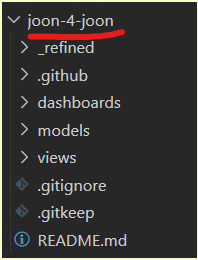
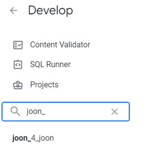

# THETOOL EXTRACTION SCRIPTS
This is a python script that extract:

1. LookML fields, views and explores directly from LookML projects
2. The following Looker System Activity views using [Looker API](https://cloud.google.com/looker/docs/api-intro):
    - user
    - user_facts
    - user_facts_role
    - role
    - group_user
    - group
    - dashboard
    - look
    - explore_label
    - history
    - query
    - lookml_fields
    - query_metrics

# 1. Prerequisite
## 1.1. Roles and permissions
### Looker
This script extract [Looker System Activity](https://cloud.google.com/looker/docs/system-activity-pages) data so at the minimum [the API client ID and secret](#263-replace-the-your_api3_client_id--and-your_api3_client_secret-with-your-api-client-id-and-secret) need to have `see_system_activity` permission.
### GCP
This script will ingest extracted data to a BigQuery dataset so make sure that the roles `BigQuery Data Editor` and `BigQuery Job User` is granted to the appropriate GCP projects.
### LookML project repositories
This script will extract LookML element from raw LookML code cloned to your local environment so make sure that you have at least `read` permission on all the LookML repositories that you want to extract.
# 2. Setting up
## 2.1. Authenticate using `gcloud` SDK
Run the following command and follow the instruction appear on your Terminal screen.
```bash
gcloud auth application-default login
```


## 2.2. Go to the `extraction` directory:
```bash
cd extraction
```

## 2.3. Set up Python environment and install requirements
*(this step is optional if you use our [quickstart](#31-quick-start-way) script - we'll create a virtual environment for you.)*


```bash
python -m venv .venv
source .venv/bin/activate
pip install -r requirements.txt
```

## 2.4. Configuring `.env`

### 2.4.1. Make a copy of `sample.env` and name it `.env`
```bash
cp sample.env .env
```
### 2.4.2. Configure destination BigQuery dataset
Replace the place holder values in `BQ_PROJECT_ID` and `BQ_DATASET_ID` with your destination BigQuery project and dataset that you want the script to ingest data to.

Example:
```
BQ_PROJECT_ID=<destination_bigquery_project_id>
BQ_DATASET_ID=<destination_bigquery_dataset_id>
```
## 2.5. Configuring `looker_project.json`
The script relies on the `root folder naming` of the LookML repo to determine the LookML project of its code. And most of the times, the `project ID` on Looker doesn't match this root folder naming. Therefore, to run the script effectively a 1-to-1 mapping of these `root folder names` and their `Looker project ID` need to be explicitly specified in this step.

For example, this is one LookML repo in our organization. Notice the root folder name is `joon-4-joon` all dash '-' separated


However, this project in Looker is named as `joon_4_joon`, which is now underscore '_' separated.


### 2.5.1. Make a copy of `sample.looker_project.json` and name it `looker_project.json`
```bash
cp sample.looker_project.json looker_project.json
```
### 2.5.2. Update mappings
Fill in the json a dictionary under the format below. Each element in the dictionary represent 1 LookML repository to be extracted specified in [this step](#27-configuring-repostxt).
```json
{
    "folder_name_1": "looker_project_id_1",
    "folder_name_2": "looker_project_id_2"
}
```

Continue the example `joon-4-joon` above, our mapping should look like this.
```json
{
    "joon-4-joon": "joon_4_joon"
}
```

## 2.6. Configuring `looker.ini`

### 2.6.1. Make a copy of `sample.looker.ini` and name it `looker.ini`
```bash
cp sample.looker.ini looker.ini
```
### 2.6.2. Replace the _&lt;your_looker_endpoint&gt;_ in `base_url` with your instance url.

Example:
```
base_url=https://example.cloud.looker.com:19999
```

### 2.6.3. Replace the _&lt;your_API3_client_id&gt;_  and _&lt;your_API3_client_secret&gt;_ with your API client ID and secret.

Refer to [this guide](https://cloud.google.com/looker/docs/api-auth#authentication_with_an_sdk) to create client ID and secret for this step.

## 2.7. Configuring `repos.txt`
> [!IMPORTANT]
> This step is required if you run want to run the [Quick start bash script](#31-quick-start-way).

For each of the LookML repos to be extracted, the script require their URL in order to clone them to local to run.

### 2.7.1. Make a copy of `sample.repos.txt` and name it `repos.txt`
```bash
cp sample.repos.txt repos.txt
```
### 2.7.2. Update `repos.txt`
Each line should contain 1 git repo URL.


# 3. Usage
There are 2 ways to run the script.

## 3.1. Quick start way
We prepared a bash script that makes sure all the configurations are in place then run the extraction for you. All you need to do is:
### 3.1.1. Make sure that the [Setting up](#2-setting-up) step 1 to 7 are in place
### 3.1.2. Run
```bash
cd ..
bash install.sh
```
### 3.1.3. Wait....
... and address issues (if any) as they pop up.

## 3.2. Manual way
If somehow our [Quick start](#31-quick-start-way) doesn't work or you want to re-extract a specific table, follow these steps.

### 3.2.1. Make sure that step 1 to 6 of the [Setting up](#2-setting-up) is good

### 3.2.2. Run `main.py`
For extracting all tables run
```bash
python main.py
```
For extracting 1 specific table run
```bash
python main.py -t <table_name>
```

> [!CAUTION]
> The script is running on full refresh mode so old data will be purged!!!


